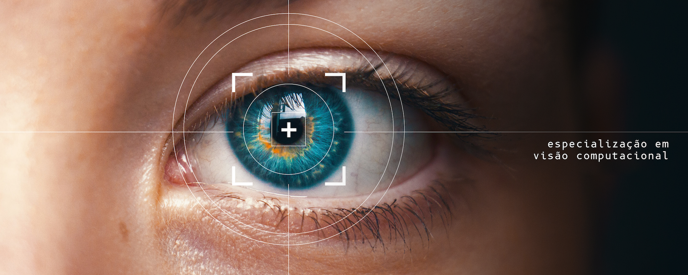
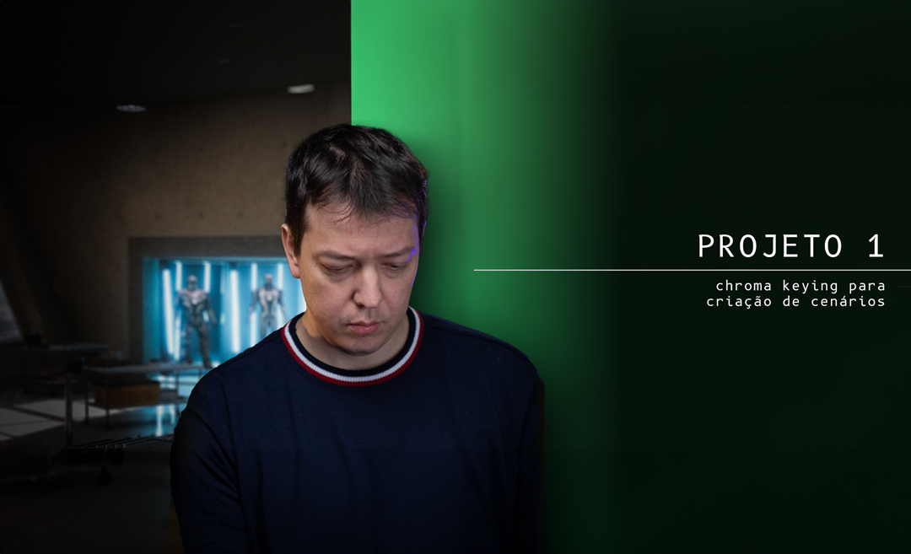
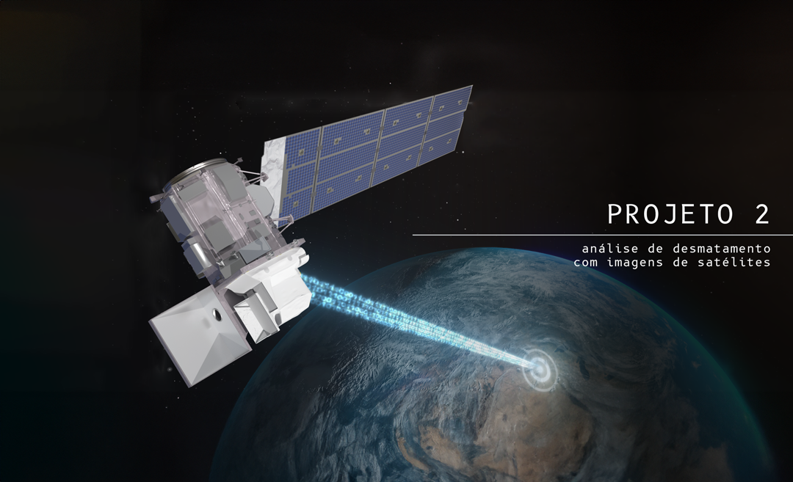
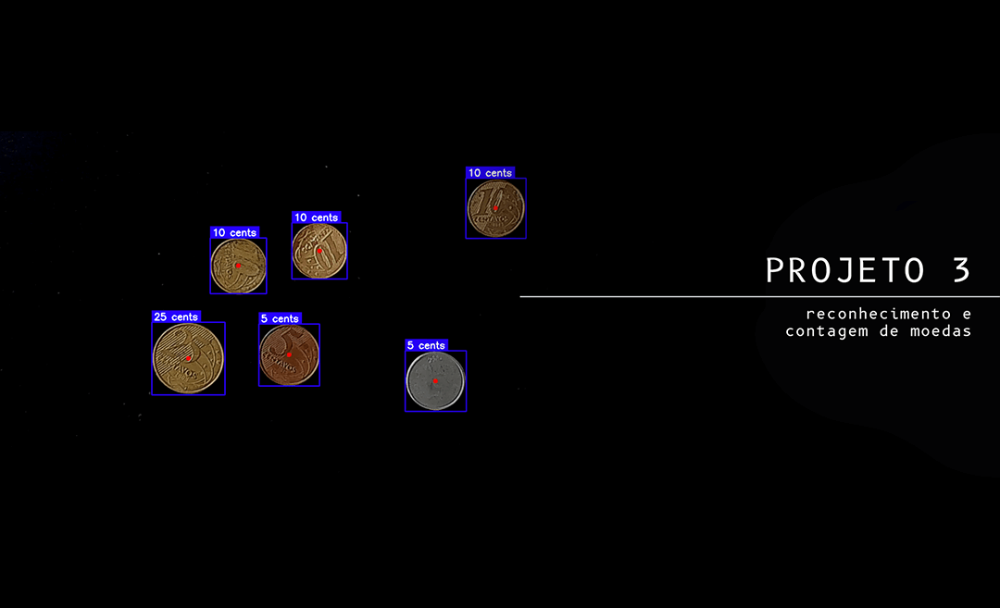
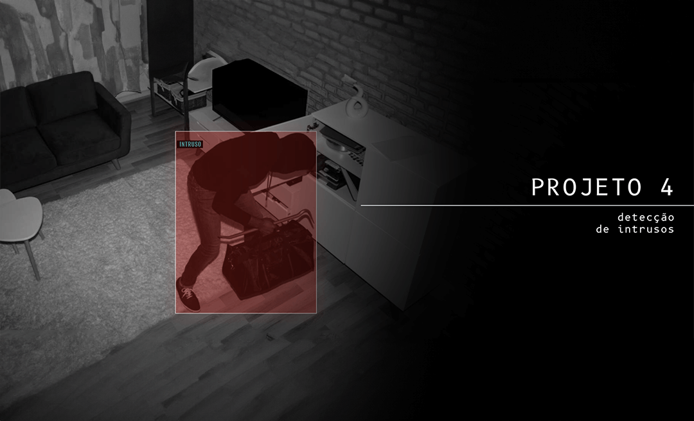

[](https://sigmoidal.ai/)

<div align="center">
  
  [](https://www.linkedin.com/in/carlos-melo-data-science/)
  [](https://www.youtube.com/@CarlosMeloSigmoidal)
  [](https://www.instagram.com/carlos_melo.py)
  [](https://twitter.com/carlos_melo_py)

</div>

# Especialização em Visão Computacional

Este repositório é dedicado à "Especialização em Visão Computacional". Siga os passos abaixo para configurar o ambiente de desenvolvimento local e instalar as dependências utilizadas durante as aulas.

## Pré-requisitos

* **VSCode** - Editor de código utilizado durante o treinamento. Disponível para Windows, macOS e Linux. [Instalação oficial do VSCode](https://code.visualstudio.com/download)

* **Pyenv** - Ferramenta para gerenciar múltiplas versões do Python. A versão recomendada do Python para este projeto é a `3.11.3`. [Instruções oficiais de instalação do Pyenv](https://github.com/pyenv/pyenv#installation)

* **Poetry** - Ferramenta de gerenciamento de dependências em Python. [Instruções oficiais de instalação do Poetry](https://python-poetry.org/docs/#installation)

* **Git** - Ferramenta de controle de versão distribuído. [Instruções oficiais de instalação do Git](https://git-scm.com/book/en/v2/Getting-Started-Installing-Git)

* **GitHub** - Plataforma de hospedagem de código. É essencial ter uma conta para interagir com os repositórios. [Como criar uma conta no GitHub](https://docs.github.com/pt/get-started/onboarding/getting-started-with-your-github-account)

## Instalação e Configuração

Aqui está um resumo dos passos que você precisa seguir:

1. Clonar o [Repositório Github](https://github.com/carlosfab/visao-computacional) para a sua máquina local e acessar a pasta `visao-computacional`:

   ```bash
   git clone https://github.com/carlosfab/visao-computacional.git
   cd visao-computacional
   ```

2. Configurar o Poetry para criar ambientes virtuais dentro do diretório do projeto.

   ```bash
   poetry config virtualenvs.in-project true
   ```

3. Configurar a versão `3.11.3` do Python com Pyenv:

   ```bash
   pyenv install 3.11.3
   pyenv local 3.11.3
   ```

4. Instalar as dependências do projeto:

   ```bash
   poetry install
   ```

5. Ativar o ambiente virtual.

   ```bash
   poetry shell
   ```

6. Testando sua instalação

   Após seguir os passos de instalação e configuração, execute os testes para garantir que tudo está funcionando como esperado:

   ```bash
   task test
   ```

## **🚀 Material de apoio por módulo**

| Módulo | Descrição | Link para o Notebook |
|--------|-----------|----------------------|
| **1 - Introdução à Visão Computacional** | Apresentação do conteúdo do curso, conceitos fundamentais da Visão Computacional e introdução ao OpenCV. | [Notebook 1](notebooks/01_introducao_a_visao_computacional.ipynb) |
| **2 - Fundamentos do Processamento de Imagens** | Conceitos básicos das técnicas de manipulação de imagens no Processamento de Imagens. | [Notebook 2](notebooks/02_fundamentos_do_processamento_de_imagens.ipynb) |
| **3 - Filtragem e Aprimoramento de Imagens** | Técnicas de filtragem e aprimoramento de imagens e detecção de contornos baseada em bordas. | [Atualizando...](https://github.com/carlosfab/visao-computacional/blob/main/notebooks/) |
| **4 - Detecção Facial e Pontos de Referência** | Técnicas para detecção facial e identificação de pontos de referência (*landmarks*). | [Notebook 4](notebooks/04_deteccao_facial_e_landmarks.ipynb) |
| **Módulo 5 - Detecção de Objetos com *Deep Learning*** | Desenvolvimento de modelos para detecção de objetos, introdução ao TensorFlow e YOLOv8 para detecção de objetos em tempo real. | [Atualizando...](https://github.com/carlosfab/visao-computacional/blob/main/notebooks/) |

## 🚀 Projetos

Atualmente, os projetos da Especialização em Visão Computacional estão disponíveis apenas na plataforma de cursos do Sigmoidal (ao final de cada módulo), mas em breve serão atualizados neste repositório 🔥.

<p align="left">
<a href="#" title="Detecção e Substituição de Fundo em Vídeos (Chroma Key)"></a>
<a href="#" title="Detecção e Substituição de Fundo em Vídeos (Chroma Key)"><strong>Chroma Keying para criação de cenários</strong></a>
<div><strong>Projeto 01</strong> | <strong>Em Atualização...</strong></div>
<br/> Neste primeiro projeto do curso, você irá implementar um algoritmo capaz de identificar e isolar o range de intensidade do fundo verde, e substituí-lo por um cenário alternativo (que pode ser uma imagem estática ou um outro vídeo qualquer...</p>

#

<p align="left">
<a href="#" title="Análise de Desmatamento através de Imagens de Satélite"></a>
<a href="#" title="Análise de Desmatamento através de Imagens de Satélite"><strong>Análise de Desmatamento através de Imagens de Satélite</strong></a>
<div><strong>Projeto 02</strong> | <strong>Em Atualização...</strong></div>
<br/> Neste projeto você irá aprender a usar recursos de sensoriamento remoto para detectar desmatamentos em regiões de florestas. Especificamente, exploraremos imagens do satélite Landsat 8 (OLI/TIRS) usando a biblioteca Google Earth Engine (GEE)... </p>

#

<p align="left">
<a href="#" title="Reconhecimento e Contagem de Moedas"></a>
<a href="#" title="Reconhecimento e Contagem de Moedas"><strong>Reconhecimento e Contagem de Moedas</strong></a>
<div><strong>Projeto 03</strong> | <strong>Em Atualização...</strong></div>
<br/> Neste projeto você irá desenvolver um *script* para detectar e identificar diferentes tipos de moedas, além de calcular o valor total das moedas detectadas a partir de vídeos gravaods ou transmissões em tempo real via webcam...</p>

#

<p align="left">
<a href="#" title="Alarme para Detecção de Intrusos"></a>
<a href="#" title="Alarme para Detecção de Intrusos"><strong>Alarme para Detecção de Intrusos</strong></a>
<div><strong>Projeto 04</strong> | <strong>Em Atualização...</strong></div>
<br/> Este projeto tem como objetivo desenvolver um sistema de vigilância utilizando técnicas de processamento de imagem para detectar movimentos a partir de uma câmera externa. Serão utilizadas técnicas para isolar o fundo com uma máscara...</p><br/>

## Sobre o Instrutor

<p align="left">
Carlos Melo é <strong>Engenheiro de Visão Computacional</strong> com formação em Ciências Aeronáuticas pela Academia da Força Aérea e <strong>Mestrado em Engenharia Aeroespacial</strong> pelo Instituto Tecnológico de Aeronáutica (ITA).
</p>

### Contato

Para dúvidas, sugestões ou feedbacks:

* **Carlos Melo** - [Contato](https://sigmoidal.ai/contato/)
